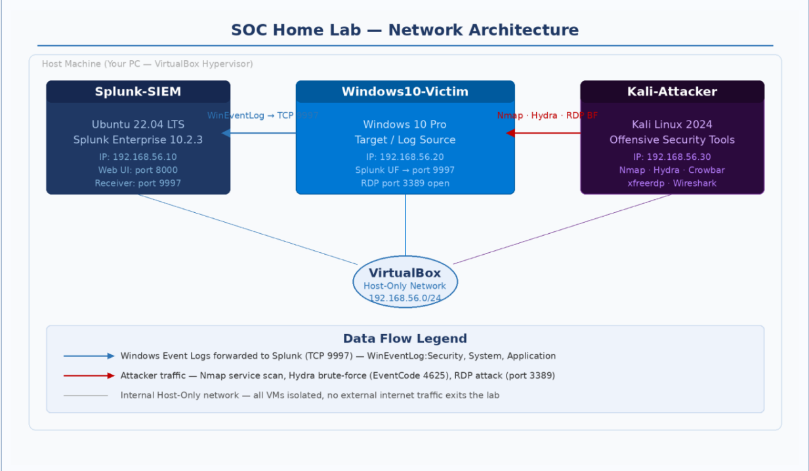
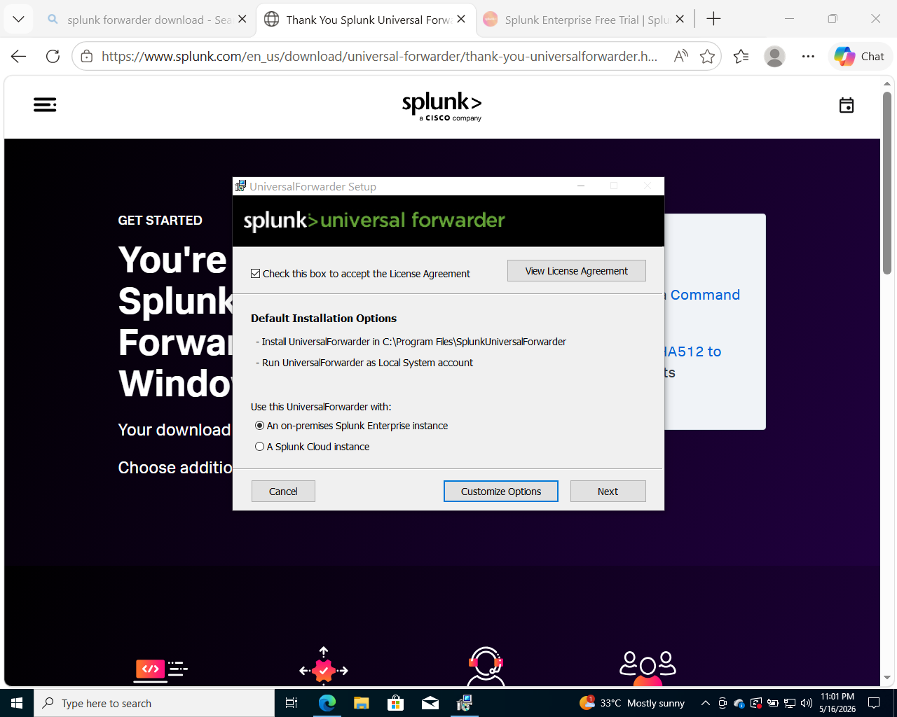
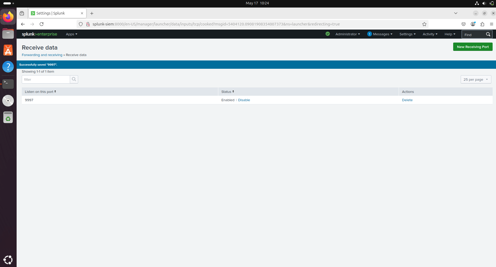
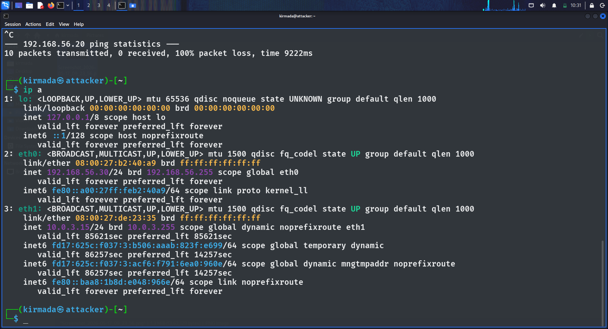
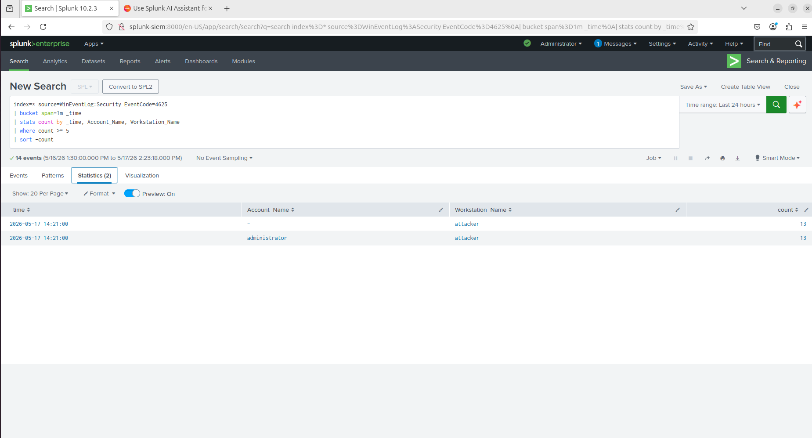
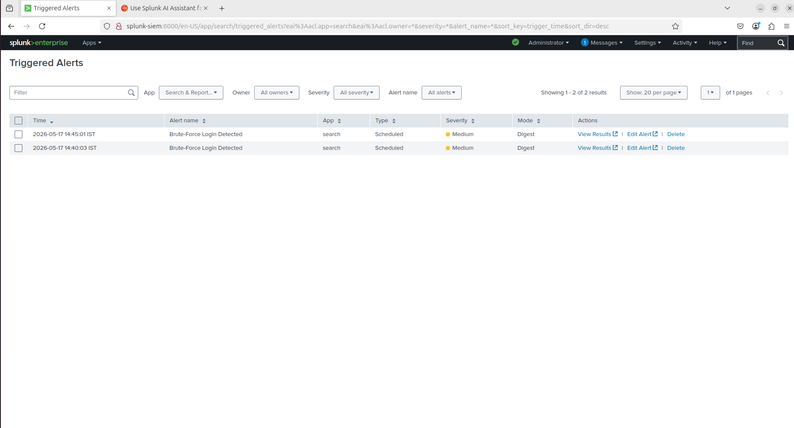
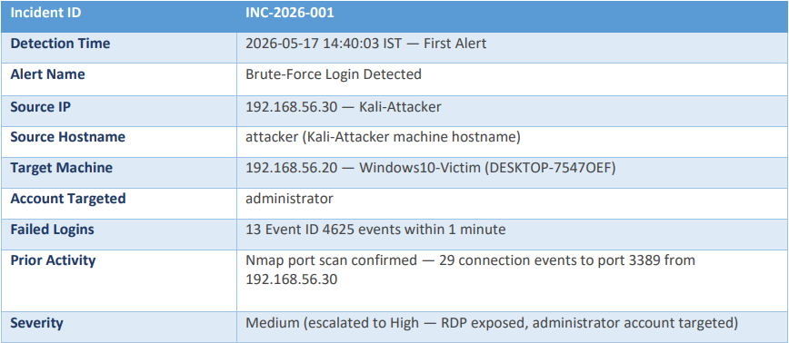

# SOC Home Lab – Security Operations Center Simulation

## Overview

This project demonstrates the design, deployment, and operation of a Security Operations Center (SOC) Home Lab using Splunk Enterprise, Windows 10, Kali Linux, Ubuntu, and Oracle VirtualBox.

The objective was to simulate a real-world SOC environment for centralized log collection, threat detection, alerting, and incident investigation. The lab was built within a controlled virtual environment to replicate common SOC analyst workflows, including monitoring security events, detecting malicious activity, generating alerts, and investigating incidents.

---

## Objectives

* Build a functional SOC environment using industry-relevant tools.
* Configure centralized log collection and analysis.
* Simulate realistic cyber attacks in a safe lab environment.
* Develop custom detection rules and alerts in Splunk.
* Practice incident investigation and response workflows.

---

## Tools & Technologies

* Splunk Enterprise
* Splunk Universal Forwarder
* Ubuntu 22.04 LTS
* Windows 10 Pro
* Kali Linux
* Oracle VirtualBox
* Windows Event Logs
* Nmap
* Hydra

---

## Skills Demonstrated

* SIEM Operations
* Splunk Administration
* Log Management
* Threat Detection
* Security Monitoring
* Alert Configuration
* Alert Tuning
* Incident Response
* Detection Engineering
* Network Security
* Windows Event Analysis
* SOC Analyst Workflows

---

## Lab Architecture

### Machines Used

| Machine          | Role                | IP Address    |
| ---------------- | ------------------- | ------------- |
| Splunk-SIEM      | SIEM & Log Server   | 192.168.56.10 |
| Windows10-Victim | Target & Log Source | 192.168.56.20 |
| Kali-Attacker    | Attack Simulation   | 192.168.56.30 |

### Architecture Diagram

---

## Log Collection & Forwarding

Windows Event Logs were forwarded from the Windows machine to Splunk Enterprise using Splunk Universal Forwarder, enabling centralized monitoring and analysis.

### Windows Splunk Universal Forwarder

### Splunk Receiver Configuration

---

## Project Workflow

1. Configure an isolated VirtualBox Host-Only Network.
2. Deploy Ubuntu, Windows, and Kali virtual machines.
3. Install and configure Splunk Enterprise.
4. Configure Splunk Universal Forwarder on Windows.
5. Forward Windows Event Logs to Splunk.
6. Simulate attacks from Kali Linux.
7. Develop SPL detection queries.
8. Configure automated alerts.
9. Investigate detected security events.

---

## Simulated Attacks

### Nmap Service Scan

Performed network reconnaissance and service enumeration against the target system.

**Detection Method**

* Network activity monitoring
* Windows Firewall event analysis
* Custom Splunk detection queries

### Detection Results

---

### Hydra RDP Brute Force Attack

Simulated repeated password guessing attempts against the Windows RDP service.

**Detection Method**

* Windows Event ID 4625 monitoring
* Failed authentication analysis
* Automated Splunk alert generation

### Detection Results

---

## Detection Engineering

Custom SPL queries were developed to identify:

* Port scanning activity
* Multiple failed login attempts
* Potential brute-force attacks
* Suspicious authentication behavior

Alerts were configured to automatically notify the analyst when predefined thresholds were exceeded.

---

## Alerting & Monitoring

Automated alerts were configured in Splunk to identify and respond to suspicious activity in real time.

### Triggered Alert Evidence

---

## Incident Investigation

For each detected attack:

* Alert validation was performed.
* Source IP addresses were identified.
* Authentication logs were reviewed.
* Attack timelines were reconstructed.
* Appropriate response actions were documented.

### Investigation Workflow

---

## Key Learning Outcomes

* Understanding SOC operations and monitoring processes.
* Hands-on experience with Splunk SIEM.
* Real-time log collection and analysis.
* Detection engineering using SPL queries.
* Investigation of simulated cyber attacks.
* Practical exposure to incident response procedures.
* Experience with SIEM-based threat detection workflows.

---

## Project Documentation

📄 Full project documentation is available in:

**SOC_HomeLab_Report.pdf**

---

## Disclaimer

All activities documented in this project were conducted within a controlled and isolated laboratory environment for educational purposes only. No third-party systems, production environments, or external networks were targeted.
